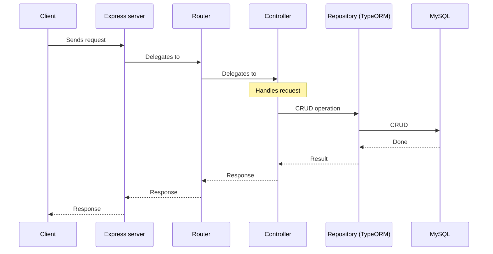
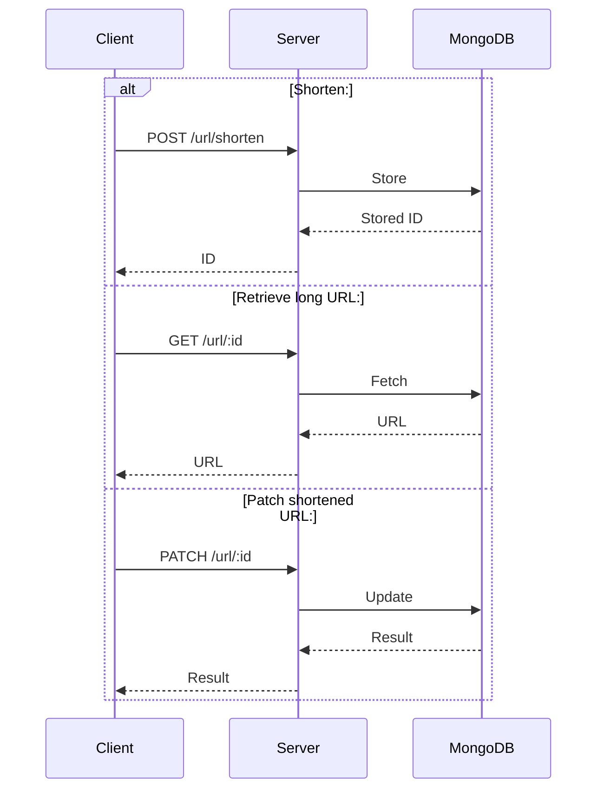

# Revisiting Node.js <!-- omit in toc -->

- [Overview](#overview)
- [Docker](#docker)
- [TypeORM](#typeorm)
- [Product](#product)
  - [Architecture](#architecture)
  - [API](#api)
- [URL Shortener](#url-shortener)
  - [Architecture](#architecture-1)
  - [API](#api-1)
- [Users](#users)

## Overview

This repo is focused on revisiting Node.js concepts. Also an amazing opportunity to also get familiar with new technologies, libraries and strategies. Here is what is being used:

- node.js
- docker
- express
- mysql
- typeorm
- mongodb

It contains really small projects that are great to revisit/learn key concepts.

## Docker

Initialize the app locally by running :

```
docker-compose watch
```

The `express-server` image supports hot-reloading, so changes in the app should automatically be reflected.

The port `8080` is exposed so you can interact with the app by sending requests to `localhost:8080`.

Destroy the container by running:

```
docker-compose down
```

## TypeORM

TypeORM requires migrations:

```
// dev
npx typeorm-ts-node-commonjs migration:run -d ./src/data/mysqldb.ts

// prod
npx typeorm migration:run -d ./dist/data/mysqldb.ts
```

## Product

### Architecture



### API

Base endpoint: `/products`.

| Action  | Method | URI              |
| ------- | ------ | ---------------- |
| index   | GET    | /products        |
| create* | GET    | /products/create |
| store   | POST   | /products        |
| show    | GET    | /products/:id    |
| patch   | PATCH  | /products/:id    |
| delete  | DELETE | /products/:id    |

> [!NOTE]
> 
> \* _Learning how to send an HTML response using express._

## URL Shortener

### Architecture



> [!NOTE]
> 
> Simplified.

### API

Base endpoint: `/url`.

| Action  | Method | URI          |
| ------- | ------ | ------------ |
| shorten | POST   | /url/shorten |
| show    | GET    | /url/:id     |
| patch   | PATCH  | /url/:id     |

## Users

Base endpoint: `/users`.

| Action | Method | URI           |
| ------ | ------ | ------------- |
| signup | POST   | /users/signup |
| signin | POST   | /users/signin |
